Wave Particles with Interactive Vortices
========================

## Final Result

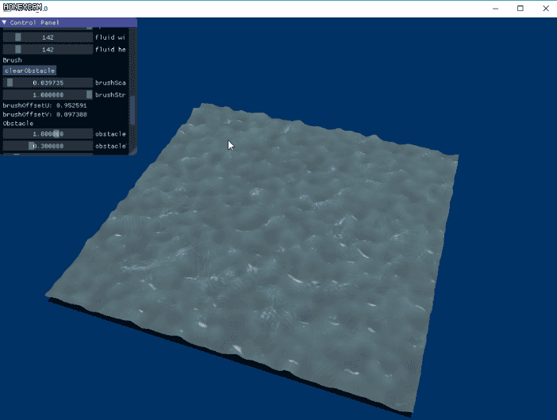

## Overview 

In game industry water can be divided into two domains, ocean and river. This project focuses on river. Not too long ago, a demo of [a real-time river editor](https://80.lv/articles/river-editor-water-simulation-in-real-time/) was developed by graphics programmer [Jean-Philippe Grenier](http://jpgrenier.org/) from Ubisoft(now Unity). We think what he did was awesome and want to replicate it (as possible as we can).

[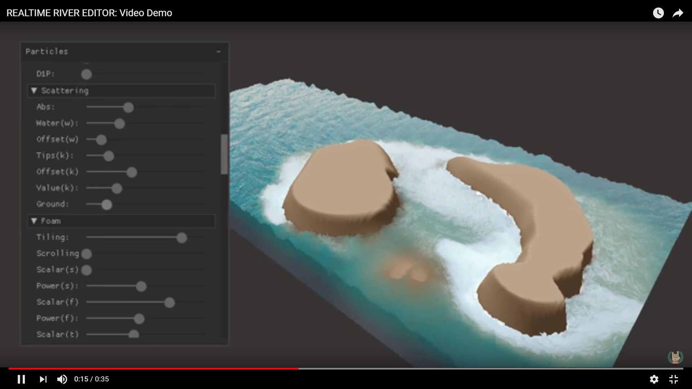](https://www.youtube.com/watch?v=--B6QZKwsdA)

Traditionally, rivers are rendered using flow maps. Flow maps are generated by fluid simulations or created by artist or even both. Flow maps are used for advection of water properties such as normal and uv. This technique can give the river a deterministic fluid look, but it fails to capture the sense of height compared with the less controlled ocean rendering techniques, which basically stack several noise functions together to generate the waves. Stacking noise functions together only works for ocean because the ocean does not flow. When you want the water both flow and have the sense of height, a new method should be used.

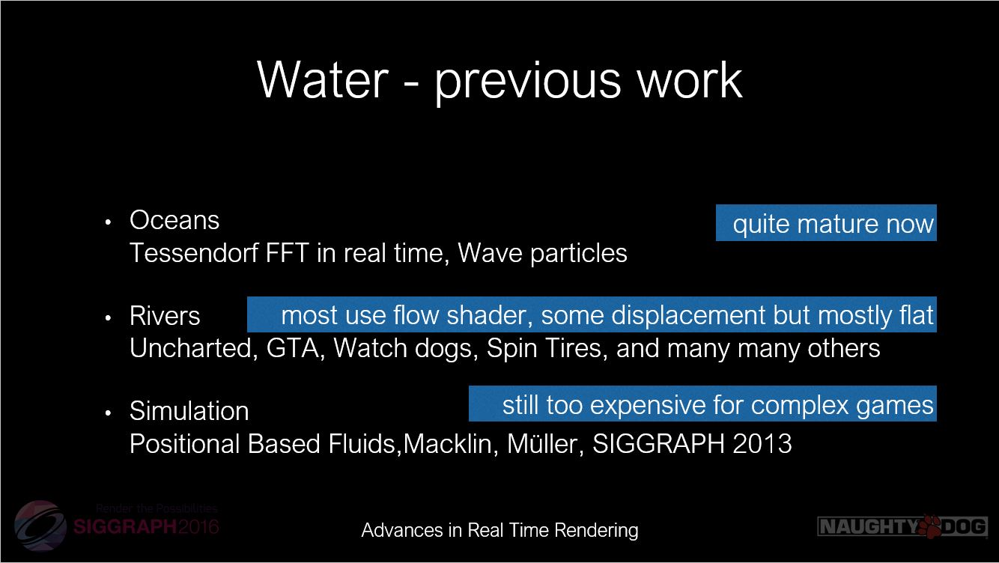

###### (picture from Rendering rapids in Uncharted 4 by Carlos Gonzalez-Ochoa, Siggraph 2016 Advances in Real-Time Rendering in Games course)

The new method is [Wave Particles](http://www.cemyuksel.com/research/waveparticles/waveparticles_sketch_slides.pdf). Initially, Wave Particles were introduced into game industry by [Naughty Dog for Uncharted 3](https://www.gdcvault.com/play/1015309/Water-Technology-of) to simulate local high frequency wave of oceans. Then it was adopted and adapted to render rivers by [Naughty Dog for Uncharted 4](http://advances.realtimerendering.com/s2016/s16_ramy_final.pptx) paired with stacking technique.

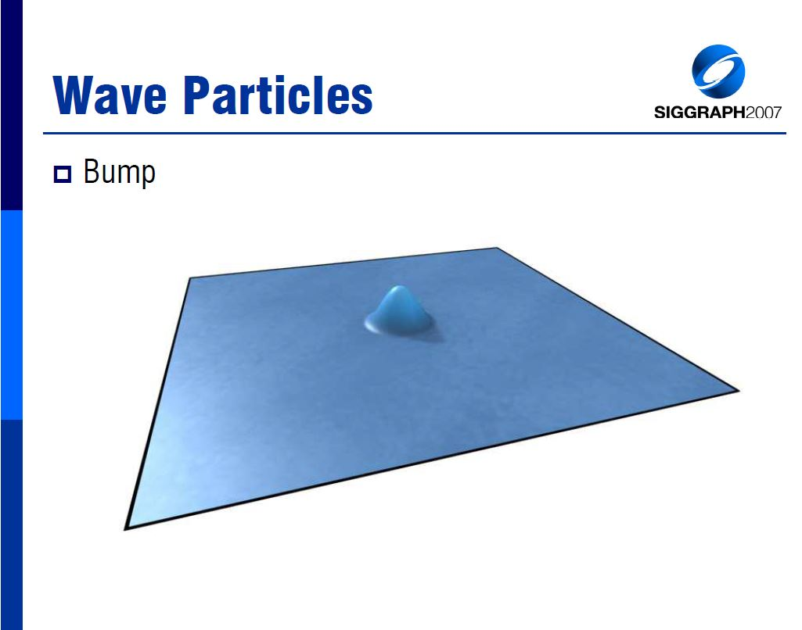

###### (picture from Implementing Wave Particles for Real-time Water Waves 2007)

The significance of the Jean-Philippe Grenier's work is that it generates flow map in real-time. That is why the user can interactively create rocks to block the river and affect the flow of river as we can see in the video. When performing advection on height and normal, previous implementations from Naughty Dog or [Valve](http://advances.realtimerendering.com/s2010/Vlachos-Waterflow(SIGGRAPH%202010%20Advanced%20RealTime%20Rendering%20Course).pdf) use noise and blending techniques to minimize repetition and pulsing caused by advection of a finite sized texture. But in this demo the developer used a new technique called [Wave Profile Buffer](http://pub.ist.ac.at/group_wojtan/projects/2018_Jeschke_WaterSurfaceWavelets/WaterSurfaceWavelets.pdf) to solve the repetition and pulsing.

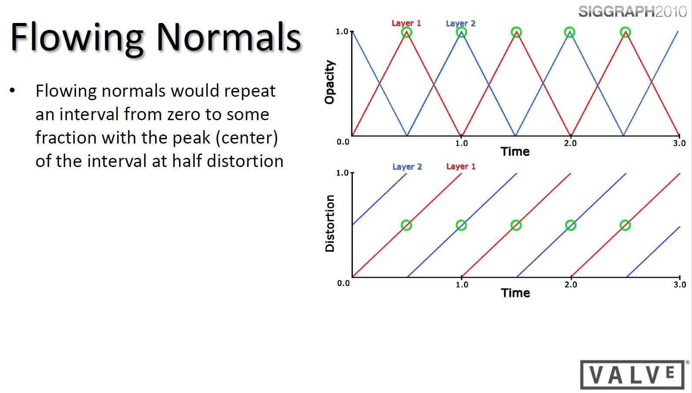

###### (picture from Water Flow in Portal 2 by Alex Vlachos, Siggraph 2010 Advances in Real-Time Rendering course)

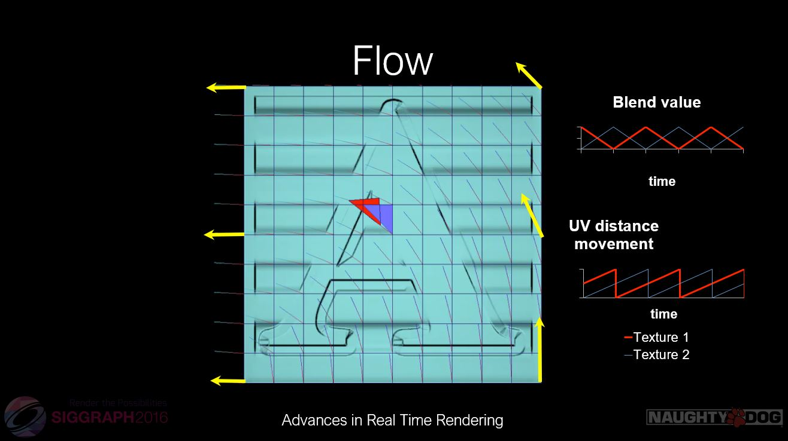

###### (picture from Rendering rapids in Uncharted 4 by Carlos Gonzalez-Ochoa, Siggraph 2016 Advances in Real-Time Rendering in Games course)

## Goals

* Simple wave particle rendering.

* Combine wave particle with flow map.

* Update flow map in real-time.

* Identify and solve the problems caused by advection of height, uv, normal. (extra features)

## Milestones

- [x] Milestone 1

  - [x] DX12 frame work

    - [x] Tessellation shader

    - [x] Basic Interaction

    - [x] Basic UI

  - [x] Basic wave particle rendering

    - [x] Single particle

- [x] Milestone 2

  - [x] Advanced wave particle rendering

    - [x] Multiple particles

  - [x] Combine flow map with wave particle

    - [x] Find some interesting flow maps

    - [x] Use flow map to advect wave particle

   - [x] Fluid simulation

- [x] Milestone 3

  - [x] Improve rendering method

    - [x] Foam

  - [x] Update flow map in real-time

    - [x] Create blockers (rocks and etc.)

    - [x] Advect properties using simulation result

- [x] Final

  - [x] Finish unfinished work

  - [x] Identify the problems caused by advection of height, uv, normal

## Milestone 1 Update

* Camera Interaction

* Wave Praticle Scale

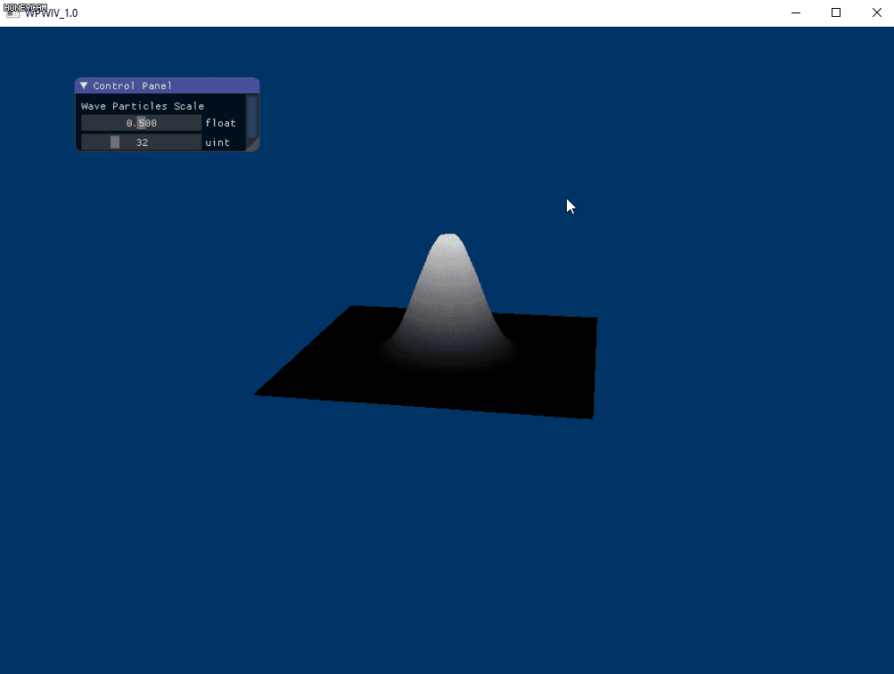

* Tessellation level

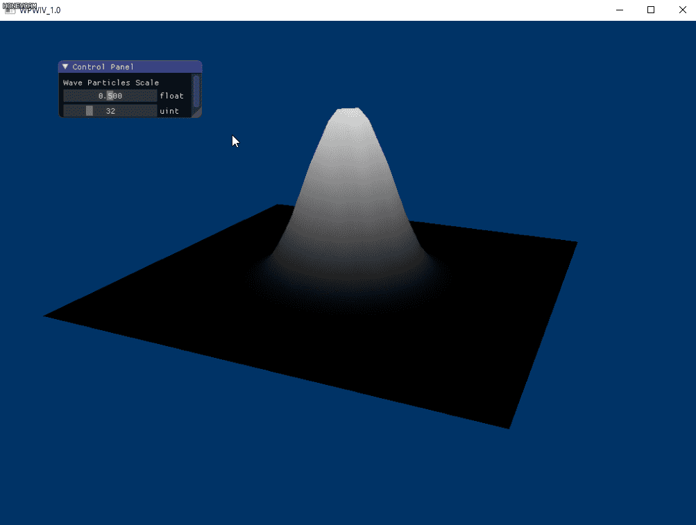

## Milestone 2 Update

* Radius

* Speed

* Wave particle with flow map

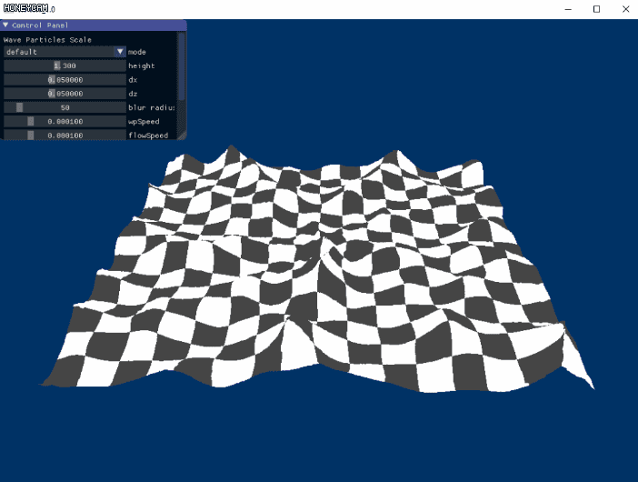

* Flow map

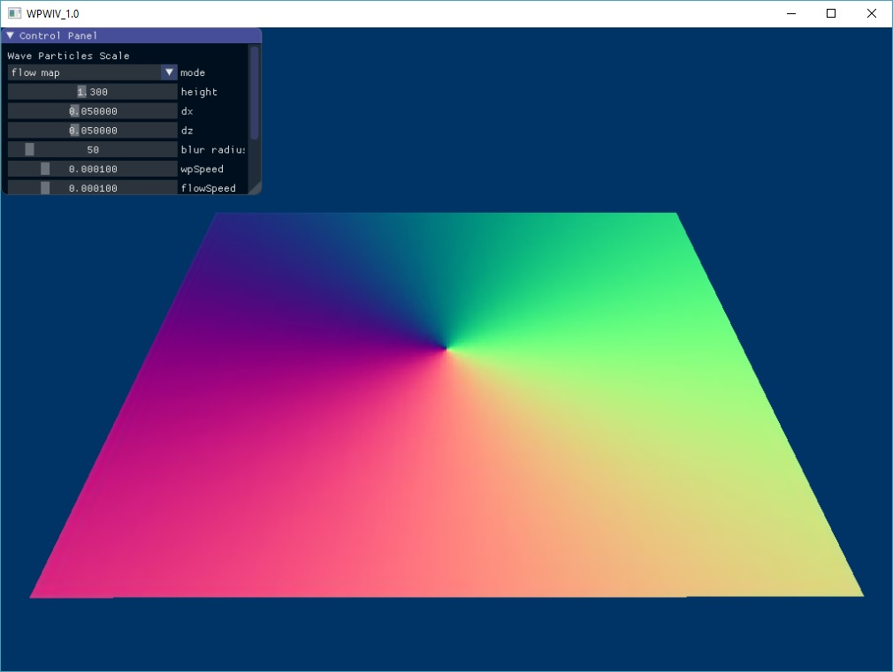

* Flow map driven texture

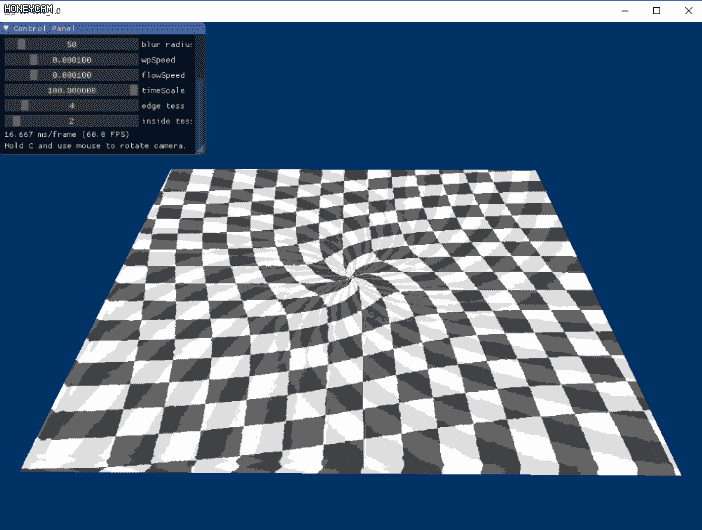

* Wave particle

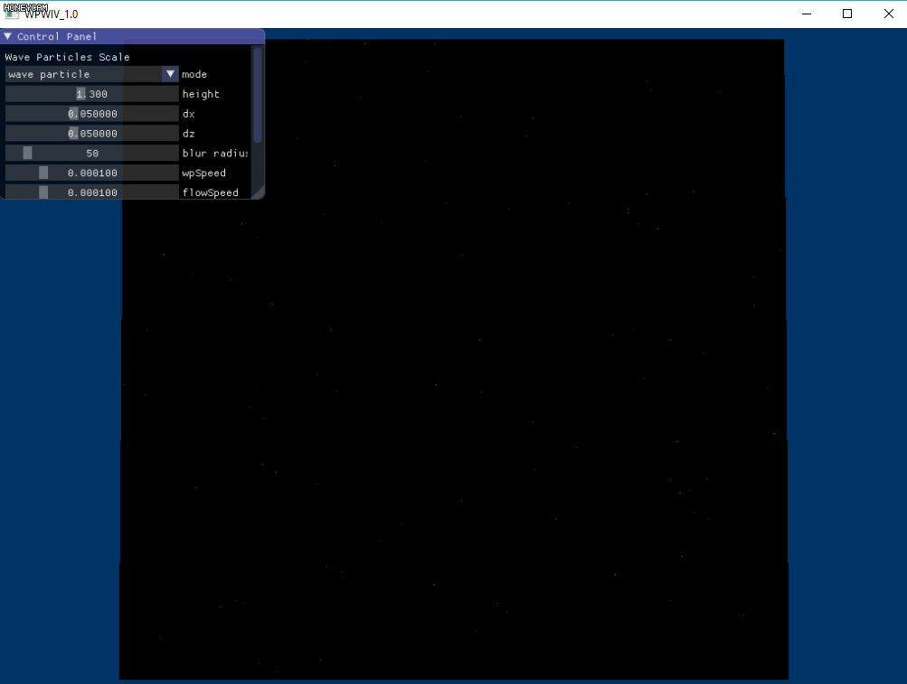

* Horizontal blur

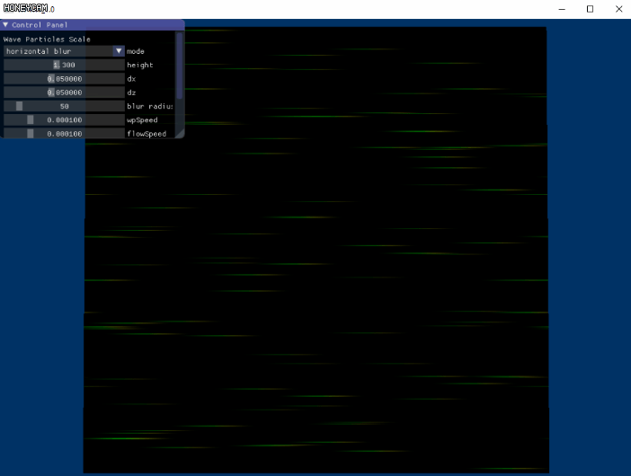

* Vertical blur

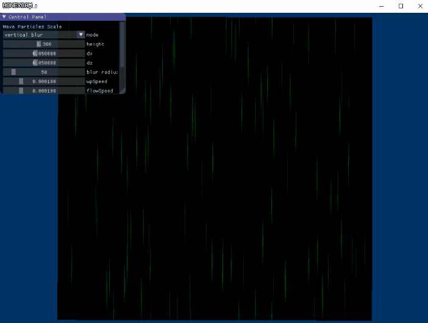

* Horizontal and vertical blur

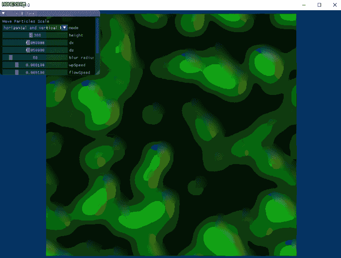

* Wave particle driven deviation

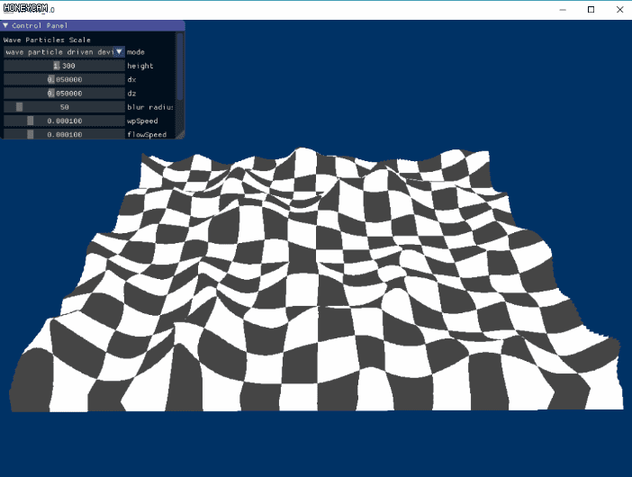

* Fluid with different cell size

* Fluid with different impulse location

* Influence of fluid density/velocity dissipation

* Flow map we will be using to guide the movement of wave particles

## Milestone 3 Update

* Specularity 

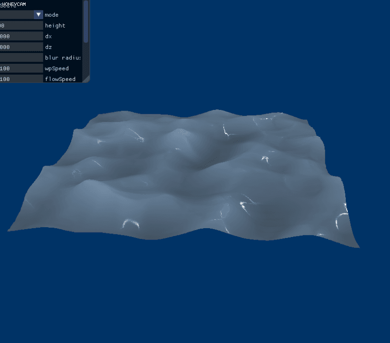

* Fluid sim with vorticity confinement

* Divergence

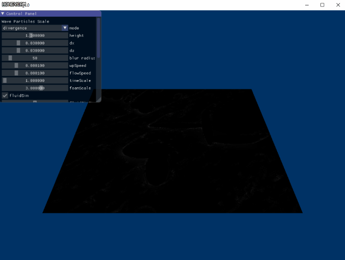

* Divergence as foam

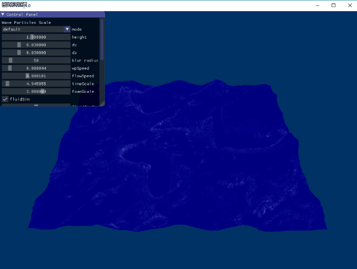

* Render with interactions

## References

[River Editor Water Simulation in Real-Time](https://80.lv/articles/river-editor-water-simulation-in-real-time/)

[Wave Particles Slides](http://www.cemyuksel.com/research/waveparticles/waveparticles_sketch_slides.pdf)

[Wave Particles Paper](http://www.cemyuksel.com/research/waveparticles/cem_yuksel_dissertation.pdf)

[Water Surface Wavelets](http://pub.ist.ac.at/group_wojtan/projects/2018_Jeschke_WaterSurfaceWavelets/WaterSurfaceWavelets.pdf)

[Uncharted 3 Ocean Rendering](https://www.gdcvault.com/play/1015309/Water-Technology-of)

[Uncharted 4 River Rendering](http://advances.realtimerendering.com/s2016/s16_ramy_final.pptx)

[Valve Flow Map](http://advances.realtimerendering.com/s2010/Vlachos-Waterflow(SIGGRAPH%202010%20Advanced%20RealTime%20Rendering%20Course).pdf)

[A 2D Fluid Solver](https://prideout.net/blog/old/blog/index.html@p=58.html)

[GPU Gems: Fast Fluid Dynamics Simulation on the GPU](https://developer.nvidia.com/gpugems/GPUGems/gpugems_ch38.html)

[A Similar Workflow](https://pdfs.semanticscholar.org/f548/cc7476e2e7e53b42befa19a376b61d12c7e9.pdf)

[Caustics](http://madebyevan.com/webgl-water/)
